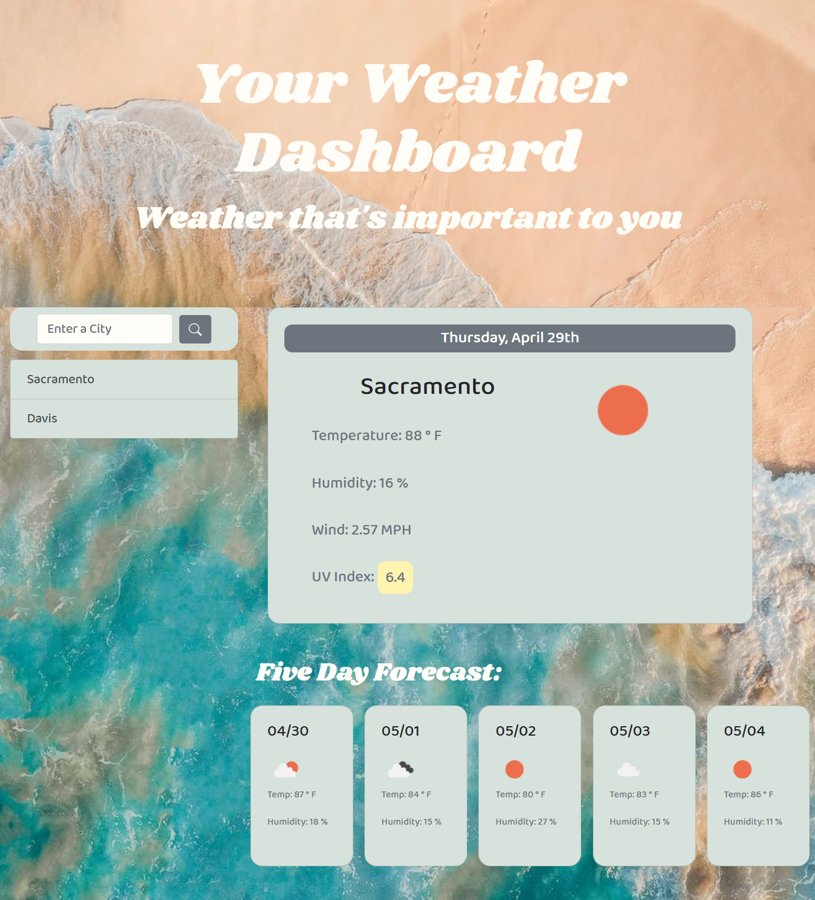

# 06 Server-Sdie APIs: Weather Dashboard

## Summary

The Weather Dashboard displays the weather for the location that is input by the user. It shows the current weather as well as the future five day forecast. The user's search history is also accessbile by buttons generated each time the user searches another city. 

## Key Features

Key features of the weather dashboard include:

* Use of the OpenWeather API, using two API calls
* Dynamic date at the top of the page that will update depending on the day
* When the user opens the page, Sacramento's weather will auto-populate the screen but will not be saved to local storage
* Data validation for user:
    * If the user fails to enter anything into the input, an error message will display
    * If the user incorrecly types in a city or the city doesn't have weather data from the API, an error message will display
* Each search history button is created dynamically and:
    * Saved to local storage (only if it's valid)
    * Is limited to a max of 10 searches
    * When clicked, the button will display the corresponding weather
* The weather icon is pulled using the weather API and corresponding url 
* Dynamic coloring for the UV Index, depending on how high it is
* Third-Party APIs:
    * Bootstrap
    * Google Fonts
* Appealing design
* Media queries allow my page to be responsive on smaller screens

## Link to Deploy

[Weather Dashboard]( https://leighdahlin.github.io/homework6/)

## Screenshots

